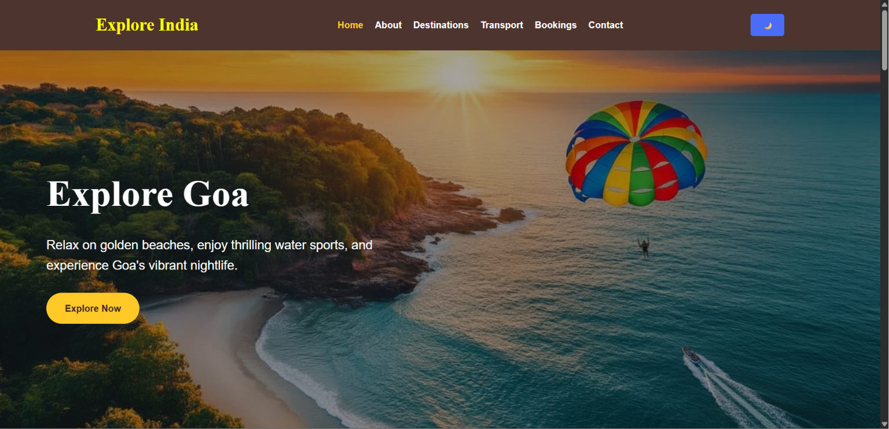
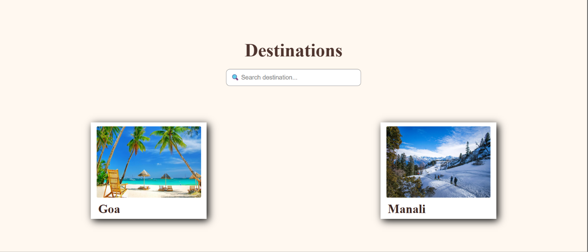
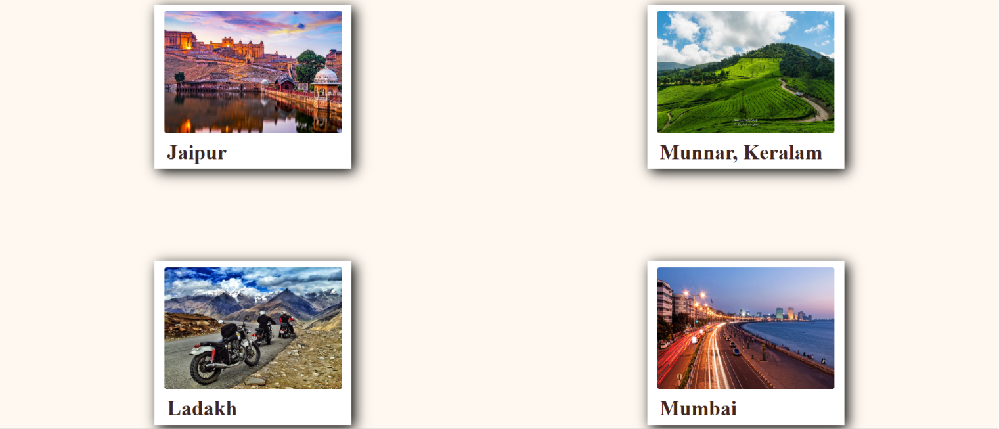
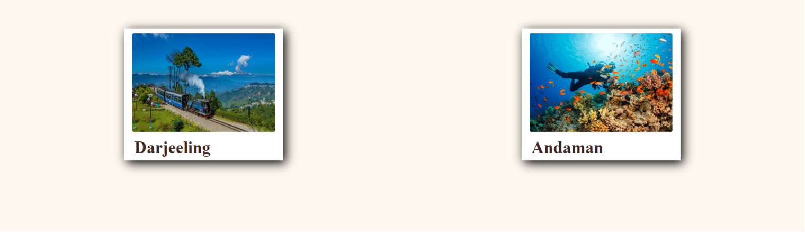
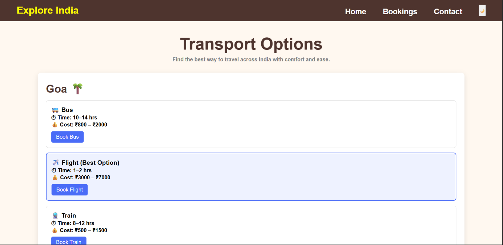
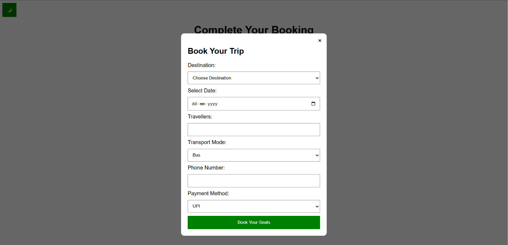
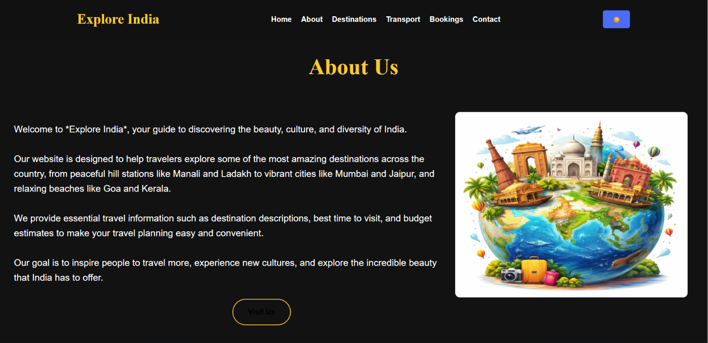
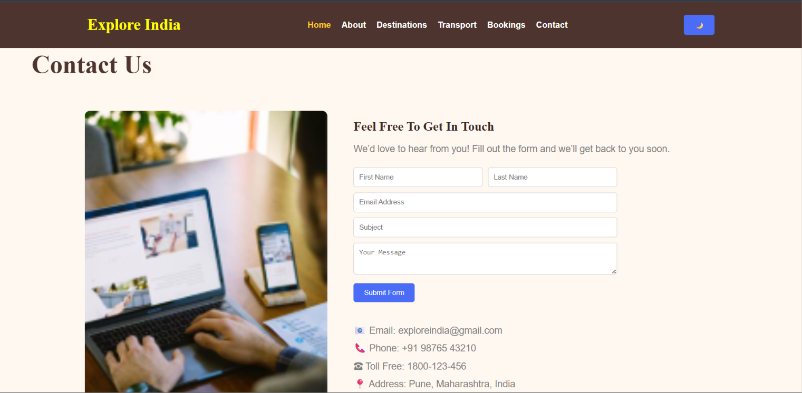

# 🇮🇳 Explore India

A modern and responsive travel website built using **HTML, CSS, and JavaScript**. Explore India's most popular tourist destinations, search places, view transport information, book trips, switch between Dark/Light mode, and access Google Maps—all in one place.

---

## 🌐 Live Demo

🔗 https://shreeya2k4.github.io/explore-india/

---

## 📂 GitHub Repository

🔗 https://github.com/shreeya2k4/explore-india

---

## ✨ Features

- 🏠 Responsive Home Page
- 🖼️ Hero Image Slider
- 📖 About Section
- 🏞️ Popular Tourist Destinations
- 🔍 Search Destination Feature
- 🌙 Dark / Light Mode
- 🚌 Transport Information Page
- 📅 Booking Page
- 📍 Google Maps Integration
- 📞 Contact Form with Validation
- 🔗 Social Media Links
- 📱 Responsive Navigation Bar
- 🎨 Attractive User Interface

---

## 🛠️ Technologies Used

- HTML5
- CSS3
- JavaScript

---

## 📁 Project Structure

```
Explore-India/
│── index.html
│── style.css
│── booking.html
│── booking.css
│── booking.js
│── transport.html
│── transport.css
│── about.png
│── contact.png
│── hero.jpg
│── hero1.jpg
│── hero2.png
│── hero3.jpg
│── hero4.jpg
│── hero5.jpg
│── img1.jpg
│── img2.jpg
│── img3.jpg
│── img4.jpg
│── img5.jpg
│── img6.jpg
│── img7.jpg
│── img8.jpg
│── README.md
```

---

## 🚀 How to Run the Project

1. Clone the repository

```bash
git clone https://github.com/shreeya2k4/explore-india.git
```

2. Open the project folder.

3. Open `index.html` in your browser.

---

## 📸 Screenshots

### 🏠 Home Page


### 🖼️ Hero Image Slider



### 🏞️ Destinations





### 🚌 Transport Page



### 📅 Booking Page



### 🌙 Dark Mode



### 📞 Contact Section



---

## 🔮 Future Improvements

- Add user authentication
- Online hotel booking API
- Weather information
- Travel itinerary planner
- Multilingual support

---

## 👩‍💻 Author

**Shreeya Punekar**

GitHub: https://github.com/shreeya2k4

LinkedIn: www.linkedin.com/in/shreya-punekar

---

⭐ If you like this project, don't forget to **Star** the repository!
